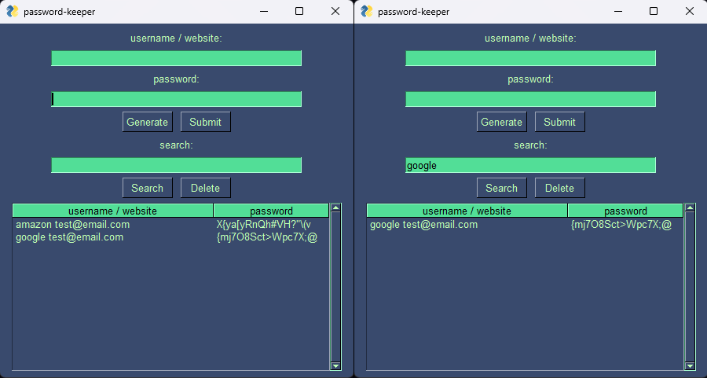

## **Password Keeper**

The Password Keeper App is an application that allows users to generate and store their passwords in a secure manner. This application is built using the Python programming language and PySimpleGUI package. Passwords will be encrypted and the database file will store only hashes for security.

## **Getting Started**

These instructions will get you a copy of the project up and running on your local machine for development and testing purposes or just for pure fun.

### **Prerequisites**

*   Python 3 installed on your system. [https://www.python.org/](https://www.python.org/)
*   You will also need to install the required libraries:
    *   PySimpleGUI: `pip install PySimpleGUI`
    *   cryptography: `pip install cryptography`
*   Alternatively, run this command for automatic module installation:  
    `pip install -r requirements.txt`

### **Installing**

1.  Clone the repository and change to the project directory.  
    **`$ git clone https://github.com/paichiwo/password-keeper.git`**  
    **`$ cd password-keeper`**
2.  Run the app.  
    **`$ python password\_keeper.py`**

## **Usage**

Upon running the application, you will be presented with an input form where you can enter the website and password details. 

Clicking on the "Submit" button will add the website and password details to the password database.
Passwords can also be generated by pressing the "Generate" button. Program will generate a random password between 14-20 characters long, using letters, numbers and symbols.  

The passwords are encrypted using the Fernet symmetric encryption algorithm provided by the cryptography package. When the user clicks on the "Submit" button, the password entered by the user is encrypted and stored in a JSON file on the local machine.

The user can also search for the password of a specific website by entering the website name in the search bar and clicking the "Search" button.

Users can delete password entries by selecting the entry from the table and clicking the "Delete" button. 

## **Customization**

Change theme: `psg.theme("name")` - [Click here for full list of themes](https://media.geeksforgeeks.org/wp-content/uploads/20200511200254/f19.jpg) 

Customize the layout and design of the application by modifying the app layout in the **password\_keeper.py** file.

## **Contributing**

Contributions to this project are welcome and appreciated. If you find any issues or have suggestions for improvements, please feel free to open an issue or pull request on the GitHub repository.

1.  Fork the repository to your own GitHub account.
2.  Clone the repository to your local machine.
3.  Create a new branch for your changes.
4.  Make your changes and commit them with clear commit messages.
5.  Push your changes to your forked repository.
6.  Open a pull request to the main repository.

## **Authors**

*   paichiwo [https://github.com/paichiwo](https://github.com/paichiwo)

## **License**

This project is licensed under the MIT License - see the LICENSE file for details.

## **Examples**

