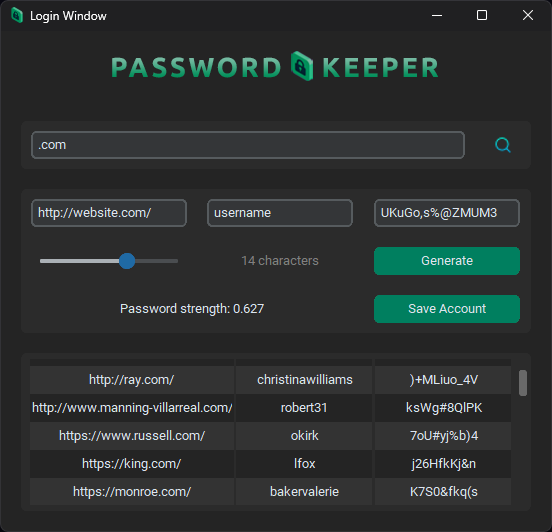

# PASSWORD KEEPER

## Info

This is a password generator app with SQLite database support, an account
creation feature and a login system.

The password generator allows you to specify the desired password length and 
provides password strength information in a floating-point format.
According to the documentation on the password_stats
library available at https://pypi.org/project/password-strength/, any password with a strength rating above 5 is 
considered to be a good password.

The application is developed using Python and leverages the "customtkinter" library, in addition to other libraries utilized in its construction.

## More info

This is a work in progress, you can find a TODO list at the bottom of this README. This list will be implemented shortly.

## Screenshots

## TODO

Here are some improvements and adjustments you can make to your application:

- Implement password hashing for both login and application functionality.
- Set up 'Enter' key functionality for the login window with the following conditions:
  - Display a message if a password is entered without an email.
  - Display a message if an email is entered without a password.
- Configure the 'Enter' key to work with the search entry in the password keeper app.
- Revise the color scheme to enhance the application's visual appeal.
- Implement a selectable table with a right-click menu that supports actions such as copy 
and delete.
- Support multiple selection
- Implement own table 
